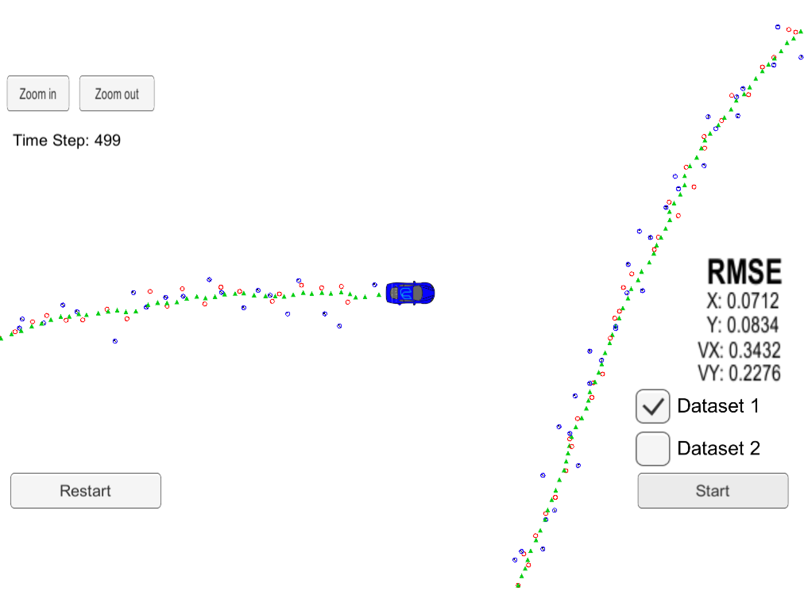
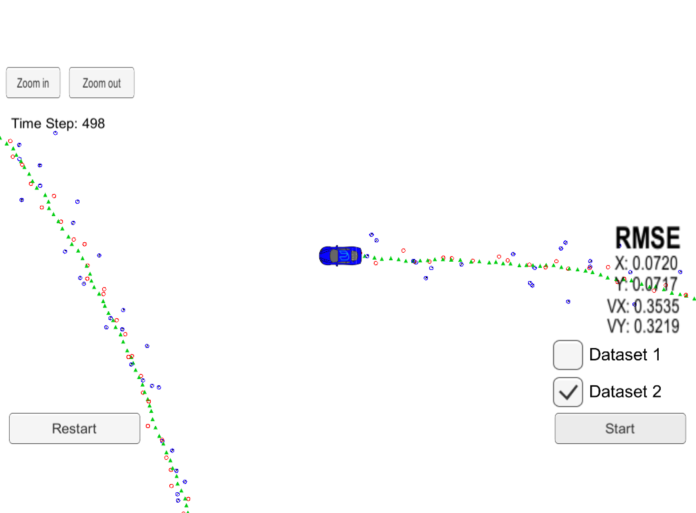

# Unscented Kalman Filter Project Starter Code
Self-Driving Car Engineer Nanodegree Program

---

## Dependencies

* cmake >= v3.5
* make >= v4.1
* gcc/g++ >= v5.4

## Basic Build Instructions

1. mkdir build
2. cd build
3. cmake ..
4. make
5. ./UnscentedKF


## Initialization paramaters
Since the instruction suggestes to tune `std_a`, `std_yawd`

* `std_a_`: process noise standard deviation longitudinal acceleration in m/s^2. I picked up a value of 2 here 

* `std_yawd_`: process noise standard deviation yaw acceleration in rad/s^2. I settled for .5 radians here.

* Radar
  * `x_`: Most of this is just an equation for the state space based off the first radar measurement. This is the first guess of the state vector. I chose 1 for all five elements for initializing and 0 for the phi_dot.
  * `P_`: The diagonal of the matrix are the variances for each value within the `x_` state space (px, py, v, yaw, yawd). Radar feeds in rho, phi and rhodot. We are given the standard deviation of each of these, and the square of the standard deviation is the variance. I chose Identity(5) here, which seems a good start from the result.
  
* Lidar
  * `x_`: The first two values are filled by the 'px' and 'py' lidar measurements. All the other values are set as 0.
  * `P_`: We are given the standard deviations for px and py from the lidar measurements, so I squared these to feed in the respective variances to the matrix. I just used 1 for the other variances along the diagonal as a reasonable beginning value.

* Others

```
  n_x_ = 5;

  n_aug_ = 7;


  lambda_ = 3 - n_aug_;

  Xsig_pred_ = MatrixXd(n_x_, 2 * n_aug_ + 1);

  //set weights
  weights_ = VectorXd(2 * n_aug_ + 1);

  weights_(0) = lambda_/(lambda_+n_aug_);
  for (int i = 1; i < 2*n_aug_+1; i++){
      weights_(i) = 0.5/(lambda_+n_aug_);
  }
```
 
## Results
Based on the provided data set, my Unscented Kalman Filter will produce the below results. The x-position is shown as 'px', y-position as 'py', velocity in the x-direction is 'vx', while velocity in the y-direction is 'vy'. Residual error is calculated by mean squared error (MSE).

### MSE for dataset 1:

| Input |   MSE   |
| ----- | ------- |
|  px   | 0.0712  |
|  py   | 0.0834  |
|  vx   | 0.3432  |
|  vy   | 0.2276  |

### MSE for dataset 2:

| Input |   MSE   |
| ----- | ------- |
|  px   | 0.0720  |
|  py   | 0.0717  |
|  vx   | 0.3535  |
|  vy   | 0.3219  |

---

### Visualization
Below are some visualizations of the results for the Unscented Kalman Filter using fused lidar and radar measurements.





